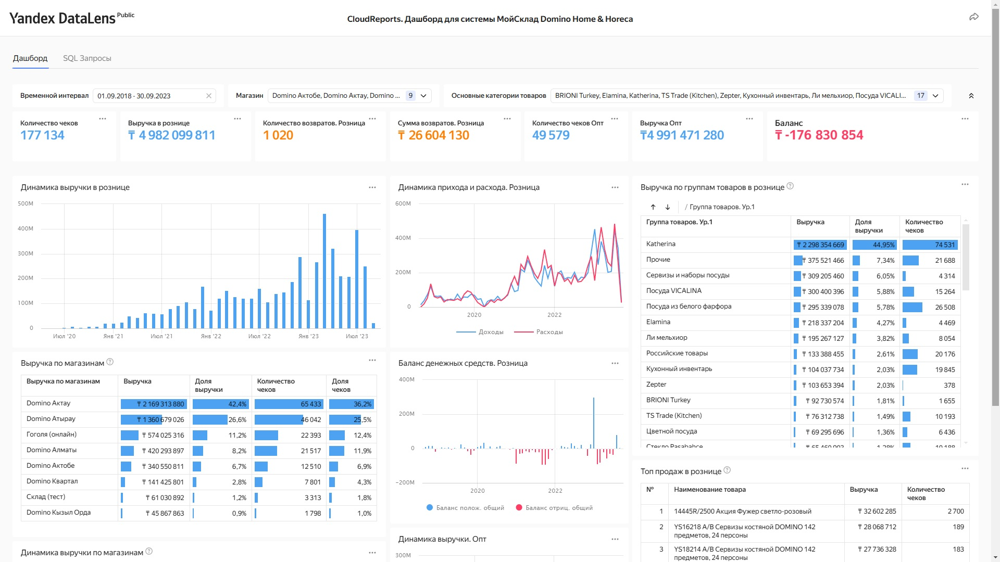
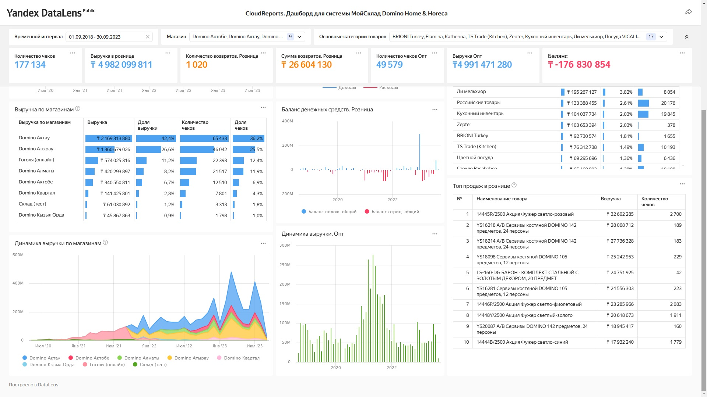

# Дашборд для анализа бизнес-метрик системы "МойСклад"

Проект разработан для владельца компании Domino Home & Horeca с целью мониторинга ключевых бизнес-показателей через интерактивный дашборд в DataLens.

https://github.com/user-attachments/assets/5b602404-96e0-4e8e-a3df-cf6a5c1fdae3

## 📊 Функциональность
Дашборд включает следующие визуализации:
1. **Динамика выручки по месяцам**  
   - Анализ роста/падения доходов.
2. **Распределение выручки по магазинам**  
   - Сравнение эффективности торговых точек.
3. **Распределение выручки по группам товаров**  
   - Выявление наиболее прибыльных категорий.
4. **Динамика прихода и расхода денежных средств**  
   - Контроль денежного потока.

## 🛠 Технологии
- **DataLens**: Основная платформа для визуализации.
- **ClickHouse**: Хранилище данных.
- **МойСклад**: Источник исходных данных о продажах.

## ⏳ Сроки реализации
Проект выполнен за 4 недели.

## 📈 Особенности
- Интеграция с ClickHouse для работы с большими объемами данных.
- Адаптивные визуализации для анализа в разрезе месяцев, магазинов и товарных групп.
- Инструмент оптимизирован для принятия стратегических решений.

 
